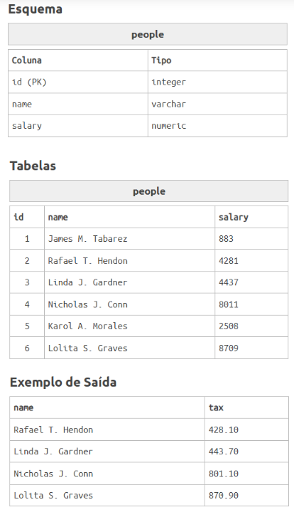

# Questão 1
Você está indo para uma reunião no plano Internacional de Taxas Pessoais, sua proposta é: toda pessoa com renda acima de 3000 deve pagar uma taxa para o governo, essa taxa é 10% do que ela ganha.

Portanto, mostre o nome da pessoa e o valor que ela deve pagar para o governo com a precisão de duas casas decimais.

