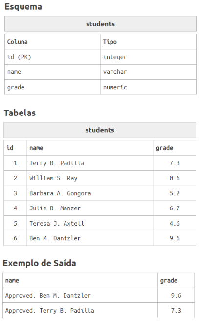

# Questão 2
O semestre acabou na Universidade do Sul da Transilvânia. Todos os cursos tiveram suas notas fechadas, apenas a disciplina de Alquimia 104 não teve a lista de alunos aprovados.

Portanto, você deverá mostrar a frase 'Approved: ' junto com o nome do aluno e a sua nota, para os alunos que foram aprovados (grade ≥7).

Lembre-se de ordenar a lista pela maior nota.

