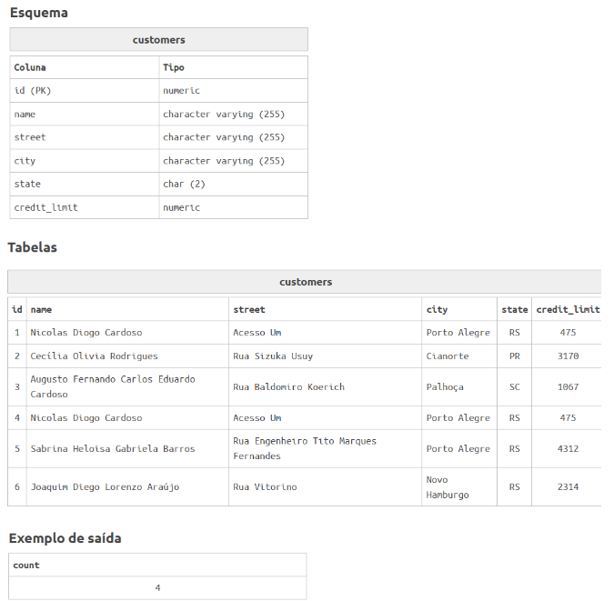

# Questão 8
A diretoria da empresa pediu para você um relatório simples de quantas cidades a empresa já alcançou.

Para fazer isso você deve exibir a quantidade de cidades distintas da tabela clientes.

